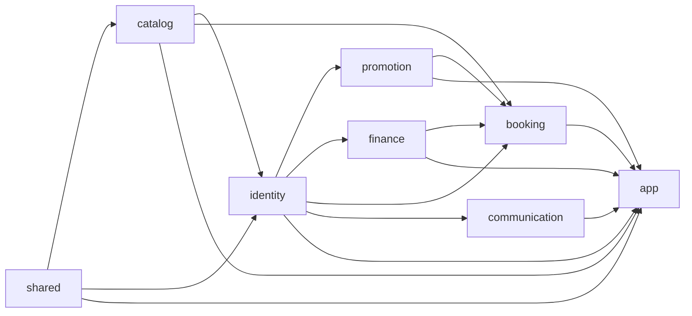

# Backend Architecture

The backend is a Maven multi-module modular monolith. Modules are divided by
business capability; each module uses a conventional layered package structure.

## Modules

| Module | Responsibility |
| --- | --- |
| `shared` | API envelope, common errors, current-user security helper |
| `modules/catalog` | Vehicle types, time slots, pricing configuration |
| `modules/identity` | Accounts, roles, authentication, customers, driver profiles, Firebase adapter |
| `modules/promotion` | Promotions, customer promotions, fare discount calculation |
| `modules/finance` | Payments, wallets, wallet transactions |
| `modules/booking` | Bookings, dispatch, driver availability cache, ratings, route calculation |
| `modules/communication` | Notifications, chat, WebSocket messaging |
| `app` | Spring Boot composition root, global configuration, reporting and cross-module orchestration |

`app` is the only executable module. The other modules are regular JARs. Module
directories use the short names above; Maven artifacts retain the explicit
`bookcar-<module>` form.

`modules/` contains business capabilities that may later become independently
deployed services. The folder is an extraction boundary, not a claim that they
are microservices already. Before extracting one, replace Java calls with a
versioned API or event contract and give it explicit data ownership.

## Infrastructure

Keycloak deployment assets live together under `keycloak/`. The custom SPI is
kept at `keycloak/providers/user-storage` as an independent Maven JAR because it
runs inside Keycloak, not inside `app`. Do not create another top-level
`keycloak-user-storage` directory.

Keycloak owns a separate `keycloak` PostgreSQL database and database user. It may
share the same PostgreSQL instance with Backend's `ridebook` database, but it
must not share Backend's database or schema. See `keycloak/README.md` for the
runtime configuration and legacy-user migration boundary.

`docker-compose.yml` is the self-contained local stack. It builds Backend and
Keycloak, creates both PostgreSQL databases, and starts dependencies according
to health checks. `docker-compose.prod.yml` contains only Backend and Keycloak;
production PostgreSQL, Redis, TLS termination, and the proxy network are
externally managed.

## Dependency direction



Arrows mean "is consumed by". Domain modules must never depend on
`app`, and modules must not import another module's `app` package.

## Module communication

- A module exposes concrete services and DTOs as its public boundary.
- Repositories and JPA/document entities stay private to their owning module.
- Small immutable enums used by public DTOs may cross the boundary; they do not
  expose persistence behavior.
- Cross-module persistence references store scalar IDs (`customerId`,
  `driverId`, `paymentId`, and similar) instead of JPA relationships.
- `app` coordinates workflows that span modules; it never queries a
  domain repository directly.
- Keep calls synchronous until an actual asynchronous requirement appears;
  add application events only for independently handled side effects.

## Package rules

- `controller`: REST controllers only.
- `service`: business logic and transaction orchestration.
- `entity`: JPA/Mongo entities, enums, and persisted business state.
- `repository`: Spring Data repositories owned by the module.
- `dto`: transport and internal data-transfer objects; use `request`, `response`,
  or integration-specific subpackages only when they contain real classes.
- `mapper`: MapStruct mappers owned by the module.
- `config`: module-specific Spring configuration.
- `util`: stateless helpers that do not belong to a service or entity.
- Do not create empty packages or interfaces with a single implementation merely
  to mirror an architectural diagram.
- Preserve public routes and DTO contracts when moving code between modules.

## Build

```bash
./mvnw -DskipTests compile
./mvnw test
```

These commands also compile and test the Keycloak user-storage provider. The
offline test suite enforces repository/entity module boundaries. Starting the
full application context additionally requires the environment variables
referenced by `app/src/main/resources/application.yaml`.
