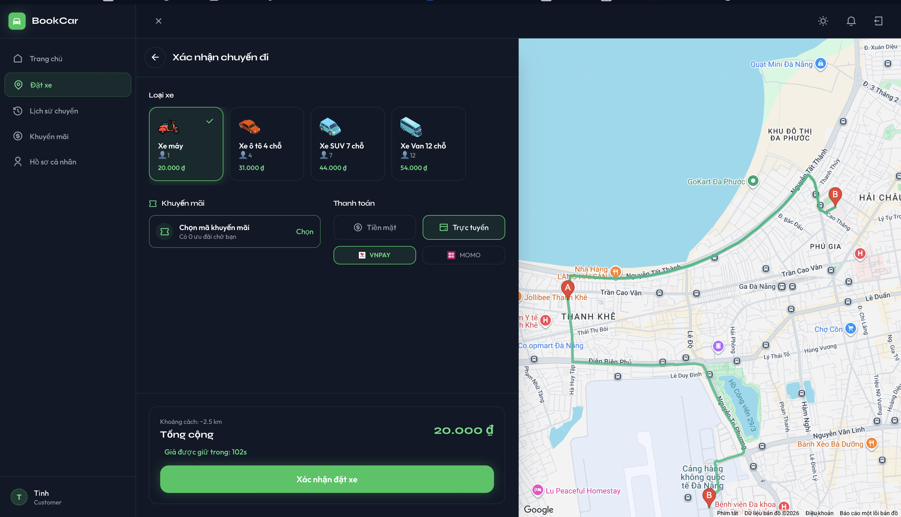
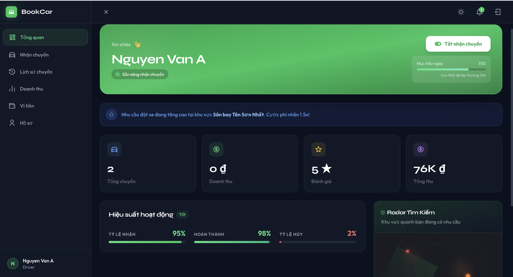
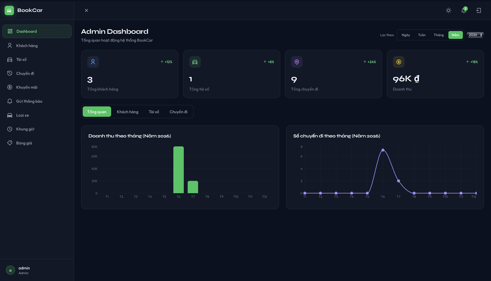

<div align="center">

# 🚗 RideBook (BookCar Online)

**Nền tảng đặt xe trực tuyến đa nền tảng kết nối hành khách và tài xế theo thời gian thực.**


[🔗 Live Demo](https://ridebook.tinhlelaptrinh.id.vn/) · [📸 Screenshots](#-demo--screenshots) · [🚀 Cài đặt](#-hướng-dẫn-cài-đặt--chạy-thử)

</div>

---

## 📋 Mục lục

- [Giới thiệu](#-giới-thiệu)
- [Demo / Screenshots](#-demo--screenshots)
- [Công nghệ sử dụng](#️-công-nghệ-tech-stack)
- [Điểm nổi bật](#-điểm-nổi-bật-features)
- [Cấu trúc dự án](#-cấu-trúc-dự-án)
- [Hướng dẫn cài đặt](#-hướng-dẫn-cài-đặt--chạy-thử)
- [Tài khoản demo](#-tài-khoản-demo)
- [Đóng góp](#-đóng-góp-contributing)
- [Liên hệ](#-liên-hệ)

---

## 📖 Giới thiệu

RideBook là một hệ thống đặt xe công nghệ (tương tự Grab/Gojek) cung cấp giải pháp toàn diện, bao gồm:

- 🧑‍💼 **Web App cho Hành khách** — đặt xe, theo dõi tài xế theo thời gian thực trên bản đồ.
- 🚕 **Web App cho Tài xế** — nhận chuyến, quản lý doanh thu.
- 💻 **Desktop App cho Quản trị viên** — điều hành và giám sát toàn hệ thống.

Hệ thống tập trung xử lý điều phối chuyến đi **real-time** với độ trễ thấp và tích hợp thanh toán ví điện tử.

---

## 📸 Demo / Screenshots

| 📱 Giao diện Khách hàng | 🚕 Giao diện Tài xế | 💻 Admin Dashboard |
|:---:|:---:|:---:|
| [](WebAPP/public/screenshots/customer/) <br> *[Xem thêm ảnh Khách hàng](WebAPP/public/screenshots/customer/)* | [](WebAPP/public/screenshots/driver/) <br> *[Xem thêm ảnh Tài xế](WebAPP/public/screenshots/driver/)* | [](WebAPP/public/screenshots/admin/) <br> *[Xem thêm ảnh Quản trị viên](WebAPP/public/screenshots/admin/)* |

🔗 **Link demo trực tiếp:** [ridebook.tinhlelaptrinh.id.vn](https://ridebook.tinhlelaptrinh.id.vn/)

---

## 🛠️ Công nghệ (Tech Stack)

Dự án được xây dựng theo kiến trúc Client-Server với hệ sinh thái công nghệ hiện đại:

### Backend (API Server)
| Hạng mục | Công nghệ |
|---|---|
| Framework | Java 21, Spring Boot 3.5 |
| Bảo mật & Xác thực | Spring Security, OAuth2 (Google/Facebook), JWT |
| Real-time | Spring WebSocket (STOMP) |
| Database | PostgreSQL (dữ liệu quan hệ), Redis (GEO, pub/sub, khóa phân tán, cache) |
| Tích hợp bên thứ 3 | Firebase Admin SDK, VNPay API, MoMo API, Google Maps API |

### Frontend (Web App)
| Hạng mục | Công nghệ |
|---|---|
| Core | React 18, Vite 5 |
| State Management | Zustand 5 |
| Styling & UI | TailwindCSS 3 |
| Bản đồ & Realtime | Google Maps API , STOMP/SockJS |
| Form & Validation | React Hook Form, Zod |
| Biểu đồ | Recharts |


### DevOps
- **Deployment:** Docker & Docker Compose (container hóa toàn bộ database)
- **Build tool:** Maven, npm

---

## ✨ Điểm nổi bật (Features)

- 🚀 **Điều phối chuyến đi Real-time (WebSocket):** Tự động tìm kiếm và phát sóng yêu cầu đặt xe tới các tài xế gần nhất theo thời gian thực, không cần reload trang.
- 🔐 **Xác thực đa phương thức:** Đăng nhập bằng SĐT/Email qua JWT; hỗ trợ SSO OAuth2 (Google, Facebook).
- 💬 **Live Chat tốc độ cao:** Nhắn tin trực tiếp giữa khách hàng và tài xế, lưu trữ trên PostgreSQL để truy xuất lịch sử nhanh.
- 💳 **Ví điện tử & Thanh toán nội bộ:** Nạp tiền qua VNPay/MoMo, tự động trừ cước và chia hoa hồng cho nền tảng.
- 🗺️ **Tích hợp bản đồ trực quan:** Google Maps API  để gợi ý địa điểm, tính khoảng cách/giá tiền, hiển thị xe di chuyển realtime.
- 📈 **Quản trị đa tầng:** Admin theo dõi doanh thu, chuyến xe, quản lý hồ sơ tài xế và loại phương tiện tập trung.

---

## 📂 Cấu trúc dự án

```
BookCar/
├── Backend/          # Spring Boot API (Java 21)
│   ├── src/
│   └── docker-compose.yml
├── WebAPP/            # React Web App (Customer & Driver & Admin)
│   ├── src/
│   └── .env.example
└── docs/
    └── screenshots/
```

---

## 🚀 Hướng dẫn Cài đặt & Chạy thử

**Yêu cầu hệ thống:** Java 21, Node.js 18+, Docker.

### Bước 1: Khởi chạy Cơ sở dữ liệu (Docker)

```bash
git clone <URL_REPOSITORY_CỦA_BẠN>
cd BookCar/Backend
docker-compose up -d
```

Lệnh trên sẽ khởi chạy PostgreSQL và Redis.

### Bước 2: Cấu hình và Khởi động Backend

1. Tạo project trên Firebase Console, tải file service account key và lưu vào:
   `Backend/src/main/resources/firebase/firebase-adminsdk.json`
2. Mở `application.yaml`, đảm bảo thông số Database (username/password) khớp với `docker-compose.yml`.
3. Chạy Backend:

```bash
./mvnw clean install -DskipTests
./mvnw spring-boot:run
```

✅ Server chạy tại: `http://localhost:8080/RideBook`

### Bước 3: Cấu hình và Khởi động Frontend

```bash
cd ../WebAPP
npm install
cp .env.example .env
```

Mở file `.env` và kiểm tra:
```
VITE_API_BASE_URL=http://localhost:8080/RideBook
```

Khởi động Web App:
```bash
npm run dev
```

✅ Truy cập tại: `http://localhost:3000`

### Bước 4: Trải nghiệm

Mở **2 trình duyệt ẩn danh**:
- Một cửa sổ đóng vai **Khách hàng** — đặt xe
- Một cửa sổ đóng vai **Tài xế** — nhận chuyến

để trải nghiệm đầy đủ luồng realtime.

---

## 🔑 Tài khoản Demo

| Vai trò | Username | Password | Tên hiển thị |
|---------|----------|----------|--------------|
| **Admin** | `admin` | `admin` | Quản trị viên hệ thống |
| **Customer** | `customer` | `123456` | Nguyễn Văn A |
| **Driver** | `driver` | `123456` | Lê Văn C |

*Bạn cũng có thể tự đăng ký tài khoản mới trực tiếp trên hệ thống.*

---

## 🤝 Đóng góp (Contributing)

Mọi đóng góp đều được hoan nghênh! Để đóng góp:

1. Fork repository
2. Tạo branch mới (`git checkout -b feature/ten-tinh-nang`)
3. Commit thay đổi (`git commit -m 'Thêm tính năng X'`)
4. Push lên branch (`git push origin feature/ten-tinh-nang`)
5. Mở Pull Request

---

---

## 📬 Liên hệ

Nếu có thắc mắc hoặc góp ý, vui lòng tạo [Issue](../../issues) trên repository hoặc liên hệ trực tiếp qua email của tác giả.

---

<div align="center">

*Dự án được xây dựng với niềm đam mê kiến tạo sản phẩm phần mềm chất lượng, áp dụng các chuẩn thiết kế và công nghệ thực tế nhất!* ⭐

</div>